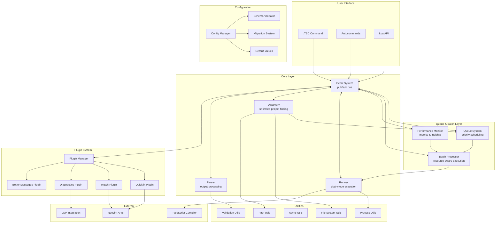
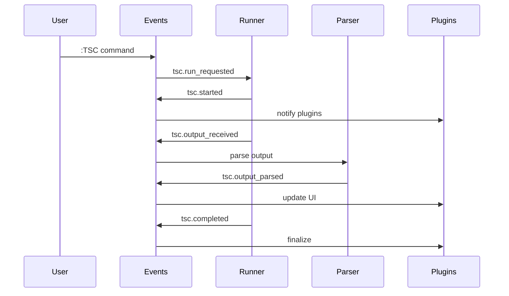
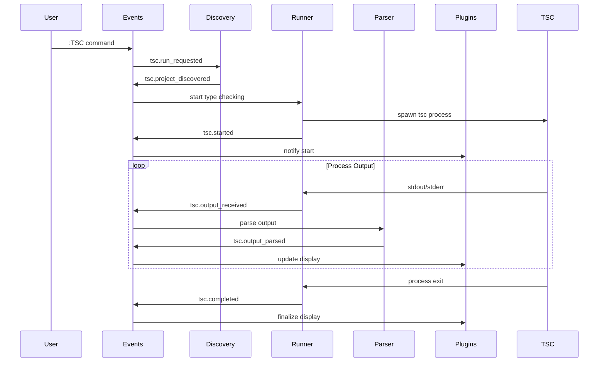
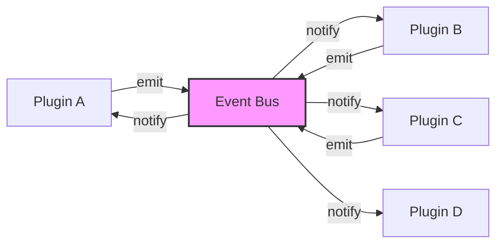
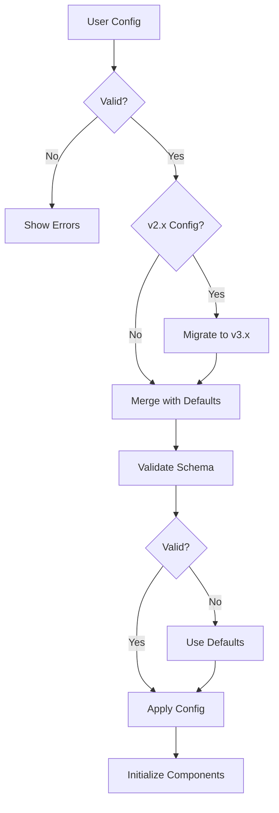

# tsc.nvim 3.0 Architecture Documentation

## Table of Contents

1. [Executive Summary](#executive-summary)
2. [Design Principles](#design-principles)
3. [Architecture Overview](#architecture-overview)
4. [Core Components](#core-components)
5. [Plugin System](#plugin-system)
6. [Configuration System](#configuration-system)
7. [Utility Layer](#utility-layer)
8. [Data Flow](#data-flow)
9. [Event System](#event-system)
10. [Testing Architecture](#testing-architecture)
11. [Developer Guide](#developer-guide)
12. [API Reference](#api-reference)

## Executive Summary

tsc.nvim 3.0 is a complete architectural rewrite of the TypeScript compiler integration plugin for Neovim. The new architecture is built around four core principles: **queue-based batch processing**, **event-driven design**, **unlimited scalability**, and **intelligent resource management**.

### Key Improvements from 2.x

- **Queue-Based Batch Processing** eliminates hard project limits and enables unlimited scalability
- **Intelligent Scheduling** processes projects based on size, priority, and dependencies
- **Progressive Results** provide feedback as batches complete, not all at once
- **Resource Management** prevents system overload with configurable concurrency limits
- **Event-driven architecture** replaces direct coupling between components
- **Plugin system** makes core functionality modular and extensible
- **Performance Monitoring** with built-in metrics and optimization recommendations
- **Better error handling** with retry logic and failure isolation
- **Comprehensive testing** with queue, batch, and monitoring test coverage

### Architecture Diagram



## Design Principles

### 1. Event-Driven Architecture
All components communicate through a central event bus, enabling loose coupling and easy extensibility.

### 2. Plugin-First Design
Core functionality is implemented as plugins, making the system modular and allowing users to customize behavior.

### 3. Configuration-Driven Behavior
All behavior is controlled through configuration, with schema validation and automatic migration.

### 4. Async-First Operations
All I/O operations are asynchronous to prevent blocking the Neovim UI.

### 5. Error Isolation
Component failures are isolated and don't cascade to other parts of the system.

### 6. Testable Design
Clear interfaces and dependency injection make the system easy to test.

## Architecture Overview

### System Layers

1. **User Interface Layer**: Commands, autocommands, and Lua API
2. **Core Layer**: Event system, runner, discovery, and parser
3. **Plugin Layer**: Modular functionality implementations
4. **Configuration Layer**: Schema validation and migration
5. **Utility Layer**: Common utilities and helpers

### Communication Patterns



## Core Components

### Event System (`lua/tsc/core/events.lua`)

The event system is the heart of tsc.nvim 3.0, providing a pub/sub mechanism for component communication.

#### Key Features

- **18 predefined events** covering the entire lifecycle
- **Asynchronous event processing** with error isolation
- **Event statistics and debugging** support
- **One-time and persistent subscriptions**

#### Event Categories

```lua
-- Lifecycle Events
'tsc.setup_completed'     -- Plugin setup finished
'tsc.teardown_started'    -- Plugin teardown started

-- Process Events  
'tsc.run_requested'       -- User requested type-checking
'tsc.started'             -- Process started
'tsc.stopped'             -- Process stopped
'tsc.completed'           -- Process completed
'tsc.cancelled'           -- Process cancelled

-- Output Events
'tsc.output_received'     -- Raw output received
'tsc.output_parsed'       -- Output parsed into errors
'tsc.errors_updated'      -- Error list updated

-- Project Events
'tsc.project_discovered'  -- Project found
'tsc.project_validated'   -- Project validated
'tsc.projects_changed'    -- Project list changed

-- Watch Events
'tsc.file_changed'        -- File changed in watch mode
'tsc.watch_started'       -- Watch mode started
'tsc.watch_stopped'       -- Watch mode stopped

-- Plugin Events
'tsc.plugin_loaded'       -- Plugin loaded
'tsc.plugin_unloaded'     -- Plugin unloaded
'tsc.plugin_error'        -- Plugin error occurred

-- Queue & Batch Events (New in 3.0)
'tsc.batch_started'       -- Batch processing started
'tsc.batch_completed'     -- Batch finished
'tsc.queue_progress'      -- Queue progress updates
'tsc.project_queued'      -- Project added to queue
'tsc.project_completed'   -- Individual project completed
```

#### Usage Example

```lua
local events = require('tsc.core.events')

-- Subscribe to events
events:on('tsc.completed', function(data)
  print('Type checking completed with', #data.errors, 'errors')
end)

-- Emit events
events:emit('tsc.started', { project = '/path/to/project' })
```

### Queue System (`lua/tsc/core/queue.lua`)

The queue system provides intelligent project scheduling and resource management.

#### Key Features

- **Multiple scheduling strategies**: FIFO, LIFO, priority, size-based, alphabetical
- **Batch operations**: Add/remove multiple projects efficiently
- **Dynamic prioritization**: Update project priorities and metadata
- **Comprehensive statistics**: Queue size, strategy metrics, project distribution

#### Scheduling Strategies

```lua
-- Size-based (recommended for large monorepos)
local queue = Queue.new({ strategy = "size" })

-- Priority-based (for custom prioritization)
local queue = Queue.new({ strategy = "priority" })

-- Alphabetical (for consistent ordering)
local queue = Queue.new({ strategy = "alpha" })
```

#### Usage Example

```lua
local Queue = require('tsc.core.queue')

-- Create queue with size-based strategy
local queue = Queue.new({ strategy = "size" })

-- Add projects with metadata
local projects = {
  { path = "/large-project", size = 100, priority = 5 },
  { path = "/small-project", size = 10, priority = 10 }
}

-- Push multiple projects
local ids = queue:push_many(projects, function(project)
  return project.priority
end, function(project)
  return { size = project.size, name = project.path }
end)

-- Process in batches
local batch = queue:pop_many(3)
```

### Batch Processor (`lua/tsc/core/batch.lua`)

The batch processor orchestrates queue-based project execution with resource management.

#### Key Features

- **Configurable batch sizes**: Process projects in optimal-sized batches
- **Concurrency control**: Limit concurrent processes to prevent overload
- **Progressive results**: Report project completion as batches finish
- **Retry logic**: Automatically retry failed projects with exponential backoff
- **Resource monitoring**: Track memory usage and processing rates

#### Batch Configuration

```lua
-- Conservative configuration for large monorepos
local config = {
  size = 3,                    -- Small batches
  concurrency = 2,             -- Conservative concurrency
  strategy = "size",           -- Process smaller projects first
  progressive_results = true,  -- Show results as they complete
  retry_failed = true,         -- Retry failed projects
  retry_count = 2,             -- Maximum retry attempts
  timeout_per_project = 30000  -- 30-second timeout per project
}

local processor = BatchProcessor.new(queue, config, events)
```

#### Processing Flow

1. **Queue Analysis**: Examine queue contents and strategy
2. **Batch Creation**: Group projects into optimally-sized batches
3. **Concurrent Execution**: Run batches with concurrency limits
4. **Progress Reporting**: Emit events for UI updates
5. **Result Aggregation**: Collect and report batch results
6. **Retry Handling**: Automatically retry failed projects

### Performance Monitor (`lua/tsc/core/monitor.lua`)

The performance monitor provides real-time metrics and optimization insights.

#### Key Features

- **Automatic metrics collection**: Track batch duration, failure rates, queue efficiency
- **Performance insights**: Detect bottlenecks and provide optimization recommendations
- **Multiple export formats**: JSON, Prometheus, table formats
- **Resource monitoring**: Track system memory and process usage

#### Metrics Categories

```lua
-- Batch processing metrics
"batch.duration"           -- Time taken per batch
"batch.total_projects"     -- Projects in batch
"batch.failures"           -- Failed batches

-- Queue efficiency metrics  
"queue.total"              -- Total projects
"queue.completed"          -- Completed projects
"queue.rate_per_second"    -- Processing rate

-- Project-level metrics
"project.duration"         -- Time per project
"project.error_count"      -- Errors per project
"project.successes"        -- Successful projects
```

#### Usage Example

```lua
local monitor = PerformanceMonitor.new(events)

-- Get performance summary
local summary = monitor:get_summary()
print("Average batch time:", summary.metrics["batch.duration"].stats.average)

-- Get optimization insights
local insights = monitor:get_insights()
for _, issue in ipairs(insights.performance_issues) do
  print("Issue:", issue.message)
  print("Recommendation:", issue.recommendation)
end

-- Export metrics
local prometheus_data = monitor:export("prometheus")
```

### Runner (`lua/tsc/core/runner.lua`)

The runner manages TypeScript compiler processes with dual-mode execution support.

#### Execution Modes

1. **Batch Mode** (New in 3.0): Queue-based execution with resource management
2. **Parallel Mode** (Legacy): Direct parallel execution for compatibility

#### Responsibilities

- **Dual-mode execution**: Batch processing for scalability, parallel for compatibility
- **Queue integration**: Seamless integration with queue and batch processor
- **Process spawning** with proper working directory handling
- **Output stream handling** (stdout/stderr) with progressive reporting
- **Process lifecycle management** and cleanup
- **Performance tracking** and statistics

#### Key Features

```lua
-- Run configuration
local run_config = {
  projects = { '/path/to/project1', '/path/to/project2' },
  flags = '--noEmit --strict',
  timeout = 30000,
  working_dir = '/path/to/workspace'
}

-- Start type checking
runner:run(run_config)
```

### Discovery (`lua/tsc/core/discovery.lua`)

The discovery system finds and validates TypeScript projects based on configuration.

#### Discovery Modes

1. **Project Mode**: Single project from current directory
2. **Package Mode**: Package within a monorepo
3. **Monorepo Mode**: All packages in a monorepo

#### Configuration

```lua
discovery = {
  mode = 'monorepo',
  root_markers = { 'package.json', '.git' },
  tsconfig_name = 'tsconfig.json',
  max_projects = 20,
  exclude_patterns = { 'node_modules', '.git', 'dist' }
}
```

### Parser (`lua/tsc/core/parser.lua`)

The parser converts TypeScript compiler output into structured data.

#### Capabilities

- **Error line parsing** with regex patterns
- **Watch mode output handling**
- **Error categorization** and severity assignment
- **Standardized output format** for consistent plugin integration
- **Error filtering, sorting, and grouping**

#### Error Format

All plugins receive errors in a standardized format:

```lua
{
  filename = 'src/index.ts',
  lnum = 10,
  col = 5,
  type = 'E',
  text = 'Type string is not assignable to type number',
  valid = 1
}
```

## Plugin System

### Plugin Manager (`lua/tsc/plugins/init.lua`)

The plugin manager handles plugin lifecycle and coordination.

#### Features

- **Plugin registration** and factory management
- **Dependency resolution** and load ordering
- **Plugin validation** and error handling
- **Runtime plugin management** (load/unload/reload)

#### Plugin Interface

Every plugin must implement this interface:

```lua
local Plugin = {}

-- Required: Setup the plugin
function Plugin:setup()
  -- Initialize plugin state
  -- Subscribe to events
  -- Setup autocommands
end

-- Required: Clean up the plugin
function Plugin:cleanup()
  -- Unsubscribe from events
  -- Clear autocommands
  -- Clean up resources
end

-- Required: Get plugin status
function Plugin:get_status()
  return {
    name = 'plugin_name',
    version = '1.0.0',
    enabled = true,
    status = 'active'
  }
end

-- Optional: Handle configuration updates
function Plugin:update_config(config)
  -- Update plugin configuration
end

return Plugin
```

### Core Plugins

#### Quickfix Plugin (`lua/tsc/plugins/quickfix.lua`)

Integrates with Neovim's quickfix list for error display.

**Events**: `tsc.completed`, `tsc.started`, `tsc.stopped`

**Configuration**:
```lua
quickfix = {
  enabled = true,
  auto_open = true,
  auto_close = true,
  auto_focus = false,
  title = 'TypeScript',
  max_height = 10
}
```

**Features**:
- Automatic quickfix list management
- Configurable open/close behavior
- Custom title and height settings
- Integration with Neovim's location list

#### Watch Plugin (`lua/tsc/plugins/watch.lua`)

Provides file watching and incremental compilation.

**Events**: `tsc.started`, `tsc.stopped`, `tsc.file_changed`

**Configuration**:
```lua
watch = {
  enabled = true,
  auto_start = false,
  debounce_ms = 500,
  patterns = { '**/*.ts', '**/*.tsx' },
  ignore_patterns = { 'node_modules/**', '.git/**' }
}
```

**Features**:
- Recursive directory watching
- Debounced file changes
- Pattern-based filtering
- Auto-start on file open

#### Diagnostics Plugin (`lua/tsc/plugins/diagnostics.lua`)

Integrates with Neovim's LSP diagnostics system.

**Events**: `tsc.completed`, `tsc.output_parsed`

**Configuration**:
```lua
diagnostics = {
  enabled = true,
  namespace = 'tsc',
  virtual_text = true,
  signs = true,
  underline = true,
  severity_map = {
    error = vim.diagnostic.severity.ERROR,
    warning = vim.diagnostic.severity.WARN,
    suggestion = vim.diagnostic.severity.HINT
  }
}
```

**Features**:
- LSP diagnostics integration
- Configurable display options
- Custom namespace management
- Severity mapping

#### Better Messages Plugin (`lua/tsc/plugins/better_messages.lua`)

Enhances TypeScript error messages with human-readable descriptions.

**Events**: `tsc.output_parsed`

**Configuration**:
```lua
better_messages = {
  enabled = true,
  template_dir = 'better-messages',
  cache_templates = true,
  custom_templates = {}
}
```

**Features**:
- Error code to human-readable message mapping
- Template system with parameter substitution
- Markdown processing
- Custom template support

**Template Example**:
```markdown
<!-- better-messages/2322.md -->
**Original**: Type '{0}' is not assignable to type '{1}'

**Better**: You're trying to assign a value of type `{0}` to a variable that expects type `{1}`. These types are incompatible.

**Common solutions**:
- Check if you're using the correct variable
- Convert the value to the expected type
- Update the type annotation to accept both types
```

## Configuration System

### Configuration Manager (`lua/tsc/config/init.lua`)

Centralized configuration management with validation and migration.

#### Features

- **Schema validation** with detailed error messages
- **Automatic migration** from 2.x to 3.x format
- **Default value merging** and runtime updates
- **Plugin-specific configuration** isolation

#### Configuration Structure

```lua
{
  -- Execution mode
  mode = 'project' | 'package' | 'monorepo',
  
  -- Project discovery settings
  discovery = {
    root_markers = { 'package.json', '.git' },
    tsconfig_name = 'tsconfig.json',
    max_projects = 20,
    exclude_patterns = { 'node_modules', '.git' }
  },
  
  -- TypeScript compiler settings
  typescript = {
    bin = '/path/to/tsc',  -- Auto-discovered if nil
    flags = '--noEmit --strict',
    timeout = 30000,
    working_dir = nil  -- Use project root if nil
  },
  
  -- Output configuration
  output = {
    auto_open = true,
    auto_close = true
  },
  
  -- Plugin configurations
  plugins = {
    quickfix = { enabled = true, auto_focus = false },
    watch = { enabled = false, auto_start = false },
    diagnostics = { enabled = false, virtual_text = true },
    better_messages = { enabled = true, cache_templates = true }
  }
}
```

### Schema Validation (`lua/tsc/config/schema.lua`)

Comprehensive schema validation system with type checking and error reporting.

#### Validation Features

- **Type validation** (string, number, boolean, table, array)
- **Enum validation** with allowed values
- **Nested object validation** with property schemas
- **Array item validation** with item schemas
- **Custom validation functions**
- **Detailed error messages** with property paths

#### Schema Example

```lua
local schema = {
  type = 'object',
  properties = {
    mode = {
      type = 'string',
      enum = { 'project', 'package', 'monorepo' },
      description = 'Project discovery mode'
    },
    discovery = {
      type = 'object',
      properties = {
        max_projects = {
          type = 'number',
          minimum = 1,
          maximum = 100,
          integer = true
        }
      }
    }
  },
  required = { 'mode' }
}
```

### Migration System (`lua/tsc/config/migration.lua`)

Automatic migration from tsc.nvim 2.x configuration format.

#### Migration Features

- **Automatic detection** of 2.x configuration
- **Property mapping** from old to new format
- **Flag conversion** from table to string format
- **Warning system** for breaking changes
- **Fallback handling** for unsupported features

## Utility Layer

### File System Utils (`lua/tsc/utils/fs.lua`)

File system operations and path management utilities.

**Key Functions**:
```lua
-- File operations
M.file_exists(path)
M.dir_exists(path)
M.is_executable(path)
M.read_file(path)
M.write_file(path, content)

-- Path operations
M.find_file_upward(filename, start_dir)
M.find_dir_upward(dirname, start_dir)
M.find_files(pattern, exclude_patterns)
M.find_files_recursive(pattern, exclude_patterns)

-- Directory operations
M.cwd()
M.cd(path)
M.get_mtime(path)
```

### Process Utils (`lua/tsc/utils/process.lua`)

Advanced process management with lifecycle control.

**Process Class**:
```lua
local process = Process.new({
  command = 'tsc',
  args = { '--noEmit', '--project', 'tsconfig.json' },
  cwd = '/path/to/project',
  timeout = 30000,
  on_stdout = function(data) end,
  on_stderr = function(data) end,
  on_exit = function(code) end
})

process:start()
process:stop()
process:is_running()
process:get_duration()
```

**Process Manager**:
```lua
local manager = ProcessManager.new()
local process = manager:start(opts)
manager:stop(process.id)
manager:stop_all()
manager:cleanup()
manager:get_stats()
```

### Async Utils (`lua/tsc/utils/async.lua`)

Asynchronous operation helpers and coroutine management.

**Promise-like Interface**:
```lua
async.run(function()
  local result = async.await(async_operation())
  return result
end):then(function(result)
  print('Result:', result)
end):catch(function(error)
  print('Error:', error)
end)
```

### Path Utils (`lua/tsc/utils/path.lua`)

Cross-platform path manipulation utilities.

**Key Functions**:
```lua
-- Path operations
M.normalize(path)
M.join(...)
M.dirname(path)
M.basename(path, suffix)
M.extname(path)

-- Path queries
M.is_absolute(path)
M.relative(from, to)
M.absolute(path, base)
M.resolve(path)

-- Pattern matching
M.matches(path, pattern)
M.is_inside(path, dir)
M.common_ancestor(paths)

-- Directory walking
M.walk(root, callback, opts)
```

### Validation Utils (`lua/tsc/utils/validate.lua`)

Input validation and type checking utilities.

**Type Checking**:
```lua
-- Basic type checks
M.type.is_string(value)
M.type.is_number(value)
M.type.is_boolean(value)
M.type.is_table(value)
M.type.is_function(value)
M.type.is_array(value)
M.type.is_empty(value)

-- Schema validation
local result = M.validate_schema(value, schema)
if not result.valid then
  for _, error in ipairs(result.errors) do
    print('Error:', error)
  end
end

-- Argument validation
M.assert_args(args, {
  { type = 'string', name = 'filename' },
  { type = 'number', name = 'timeout', optional = true }
})
```

## Data Flow

### Complete Type-Checking Flow



### Plugin Communication Flow



### Configuration Flow



## Event System

### Event Lifecycle

1. **Event Registration**: Plugins register event listeners during setup
2. **Event Emission**: Components emit events with relevant data
3. **Event Dispatch**: Event system notifies all registered listeners
4. **Error Handling**: Individual listener errors are caught and logged
5. **Event Cleanup**: Listeners are removed during plugin cleanup

### Event Data Structure

```lua
{
  name = 'tsc.completed',
  timestamp = 1634567890123,
  data = {
    project = '/path/to/project',
    errors = { ... },
    duration = 1500,
    exit_code = 0
  },
  source = 'runner'
}
```

### Custom Events

Plugins can emit custom events:

```lua
local events = require('tsc.core.events')

-- Emit custom event
events:emit('my_plugin.custom_event', {
  message = 'Something happened',
  data = { ... }
})

-- Listen for custom events
events:on('my_plugin.custom_event', function(data)
  print('Custom event received:', data.message)
end)
```

## Testing Architecture

### Test Structure

```
tests/
├── unit/                 -- Unit tests for individual modules
│   ├── core/
│   ├── plugins/
│   ├── config/
│   └── utils/
├── integration/          -- Integration tests for workflows
├── fixtures/             -- Test data and sample projects
└── helpers/              -- Test utilities and mocks
```

### Testing Patterns

#### Unit Testing

```lua
describe('EventSystem', function()
  local events
  
  before_each(function()
    events = require('tsc.core.events').new()
  end)
  
  it('should emit and receive events', function()
    local received = false
    
    events:on('test.event', function()
      received = true
    end)
    
    events:emit('test.event')
    
    assert.is_true(received)
  end)
end)
```

#### Integration Testing

```lua
describe('Full TypeScript workflow', function()
  it('should run type checking and update quickfix', function()
    -- Setup test project
    local project = test_helpers.create_project({
      'src/index.ts': 'const x: number = "string";'
    })
    
    -- Run type checking
    local tsc = require('tsc')
    tsc.setup({ mode = 'project' })
    tsc.run()
    
    -- Verify results
    local qflist = vim.fn.getqflist()
    assert.equals(1, #qflist)
    assert.matches('Type.*string.*not assignable', qflist[1].text)
  end)
end)
```

#### Mocking

```lua
-- Mock external dependencies
local mock_fs = {
  file_exists = spy.new(function() return true end),
  read_file = spy.new(function() return 'mock content' end)
}

package.loaded['tsc.utils.fs'] = mock_fs
```

### Test Configuration

```lua
-- tests/minimal_init.lua
vim.cmd [[set runtimepath=$VIMRUNTIME]]
vim.cmd [[set packpath=/tmp/nvim/site]]

-- Load test framework
local plugins = '/tmp/nvim/site/pack/test/start/'
vim.fn.system('git clone https://github.com/nvim-lua/plenary.nvim ' .. plugins .. 'plenary.nvim')

-- Load plugin
vim.cmd [[runtime plugin/plenary.vim]]
require('plenary.busted')
```

## Developer Guide

### Development Environment Setup

1. **Clone the repository**:
   ```bash
   git clone https://github.com/user/tsc.nvim.git
   cd tsc.nvim
   ```

2. **Install dependencies**:
   ```bash
   # Install test framework
   git clone https://github.com/nvim-lua/plenary.nvim.git \
     ~/.local/share/nvim/site/pack/test/start/plenary.nvim
   ```

3. **Development workflow**:
   ```bash
   # Run tests
   nvim --headless -c "PlenaryBustedDirectory tests/ {minimal_init = 'tests/minimal_init.lua'}"
   
   # Format code
   stylua lua/
   
   # Lint code
   luacheck lua/
   ```

### Code Organization

#### Directory Structure

```
lua/tsc/
├── init.lua              -- Main entry point
├── core/                 -- Core components
│   ├── events.lua        -- Event system
│   ├── runner.lua        -- Process management
│   ├── discovery.lua     -- Project discovery
│   └── parser.lua        -- Output parsing
├── plugins/              -- Plugin system
│   ├── init.lua          -- Plugin manager
│   ├── quickfix.lua      -- Quickfix integration
│   ├── watch.lua         -- File watching
│   ├── diagnostics.lua   -- LSP diagnostics
│   └── better_messages.lua -- Error enhancement
├── config/               -- Configuration system
│   ├── init.lua          -- Config manager
│   ├── schema.lua        -- Validation
│   ├── migration.lua     -- v2.x migration
│   └── defaults.lua      -- Default values
└── utils/                -- Utility modules
    ├── fs.lua            -- File system
    ├── process.lua       -- Process management
    ├── async.lua         -- Async helpers
    ├── path.lua          -- Path utilities
    └── validate.lua      -- Validation
```

#### Coding Conventions

1. **Module Structure**:
   ```lua
   ---@class ModuleName
   local M = {}
   
   -- Private functions (use local)
   local function private_helper() end
   
   -- Public functions
   function M.public_function() end
   
   return M
   ```

2. **Type Annotations**:
   ```lua
   ---@class MyClass
   ---@field property string Description of property
   local MyClass = {}
   
   ---Function description
   ---@param param1 string Parameter description
   ---@param param2? number Optional parameter
   ---@return boolean Return description
   function MyClass.method(param1, param2) end
   ```

3. **Error Handling**:
   ```lua
   -- Use pcall for error-prone operations
   local success, result = pcall(risky_operation)
   if not success then
     vim.notify('Error: ' .. result, vim.log.levels.ERROR)
     return
   end
   ```

4. **Event Handling**:
   ```lua
   -- Always use vim.schedule for UI updates
   events:on('tsc.completed', function(data)
     vim.schedule(function()
       -- Safe to update UI here
       update_quickfix(data.errors)
     end)
   end)
   ```

### Plugin Development

#### Creating a New Plugin

1. **Create plugin file**:
   ```lua
   -- lua/tsc/plugins/my_plugin.lua
   ---@class MyPlugin
   local MyPlugin = {}
   
   function MyPlugin:setup()
     self.events = require('tsc.core.events')
     
     -- Subscribe to events
     self.events:on('tsc.completed', function(data)
       self:handle_completion(data)
     end)
   end
   
   function MyPlugin:cleanup()
     -- Clean up resources
   end
   
   function MyPlugin:get_status()
     return {
       name = 'my_plugin',
       version = '1.0.0',
       enabled = true,
       status = 'active'
     }
   end
   
   function MyPlugin:handle_completion(data)
     -- Plugin logic here
   end
   
   return MyPlugin
   ```

2. **Register plugin**:
   ```lua
   -- In plugin configuration
   plugins = {
     my_plugin = {
       enabled = true,
       -- Plugin-specific config
     }
   }
   ```

#### Plugin Best Practices

1. **Use events for communication**
2. **Handle errors gracefully**
3. **Clean up resources properly**
4. **Provide status information**
5. **Follow naming conventions**
6. **Document configuration options**

### Contributing Guidelines

1. **Before submitting a PR**:
   - Run all tests
   - Format code with stylua
   - Update documentation
   - Add tests for new features

2. **Commit message format**:
   ```
   type(scope): description
   
   feat(plugins): add new diagnostics integration
   fix(core): resolve event listener memory leak
   docs(readme): update installation instructions
   test(core): add event system unit tests
   ```

3. **Pull request checklist**:
   - [ ] Tests pass
   - [ ] Code formatted
   - [ ] Documentation updated
   - [ ] Changelog updated
   - [ ] Breaking changes noted

## API Reference

### Public API

#### Main Module (`require('tsc')`)

```lua
local tsc = require('tsc')

-- Setup with configuration
tsc.setup({
  mode = 'project',
  plugins = {
    quickfix = { enabled = true }
  }
})

-- Run type checking
tsc.run()

-- Stop current run
tsc.stop()

-- Get status
local status = tsc.get_status()

-- Get configuration
local config = tsc.get_config()

-- Update configuration
tsc.update_config({ mode = 'monorepo' })
```

#### Event System API

```lua
local events = require('tsc.core.events')

-- Subscribe to events
local unsubscribe = events:on('event.name', callback)

-- One-time subscription
events:once('event.name', callback)

-- Emit events
events:emit('event.name', data)

-- Remove listener
unsubscribe()

-- Get event statistics
local stats = events:get_stats()
```

#### Plugin Manager API

```lua
local plugin_manager = require('tsc.plugins')

-- Get plugin status
local status = plugin_manager:get_plugin_status('quickfix')

-- Reload plugin
plugin_manager:reload_plugin('quickfix')

-- List all plugins
local plugins = plugin_manager:list_plugins()
```

### Configuration Schema

#### Root Configuration

| Property | Type | Default | Description |
|----------|------|---------|-------------|
| `mode` | `string` | `'project'` | Discovery mode: `'project'`, `'package'`, `'monorepo'` |
| `discovery` | `object` | `{}` | Project discovery settings |
| `typescript` | `object` | `{}` | TypeScript compiler settings |
| `output` | `object` | `{}` | Output formatting settings |
| `plugins` | `object` | `{}` | Plugin configurations |

#### Discovery Configuration

| Property | Type | Default | Description |
|----------|------|---------|-------------|
| `root_markers` | `string[]` | `['package.json', '.git']` | Files/dirs that indicate project root |
| `tsconfig_name` | `string` | `'tsconfig.json'` | TypeScript config file name |
| `max_projects` | `number` | `20` | Maximum projects to discover |
| `exclude_patterns` | `string[]` | `['node_modules', '.git']` | Patterns to exclude |

#### TypeScript Configuration

| Property | Type | Default | Description |
|----------|------|---------|-------------|
| `bin` | `string?` | `nil` | Path to TypeScript compiler (auto-discovered) |
| `flags` | `string` | `'--noEmit'` | Compiler flags |
| `timeout` | `number` | `30000` | Process timeout in milliseconds |
| `working_dir` | `string?` | `nil` | Working directory (project root if nil) |

#### Output Configuration

| Property | Type | Default | Description |
|----------|------|---------|-------------|
| `auto_open` | `boolean` | `true` | Auto-open quickfix list |
| `auto_close` | `boolean` | `true` | Auto-close quickfix list |

#### Plugin Configurations

##### Quickfix Plugin

| Property | Type | Default | Description |
|----------|------|---------|-------------|
| `enabled` | `boolean` | `true` | Enable quickfix integration |
| `auto_open` | `boolean` | `true` | Auto-open quickfix list |
| `auto_close` | `boolean` | `true` | Auto-close when no errors |
| `auto_focus` | `boolean` | `false` | Auto-focus quickfix window |
| `title` | `string` | `'TypeScript'` | Quickfix list title |
| `max_height` | `number` | `10` | Maximum quickfix window height |

##### Watch Plugin

| Property | Type | Default | Description |
|----------|------|---------|-------------|
| `enabled` | `boolean` | `false` | Enable file watching |
| `auto_start` | `boolean` | `false` | Auto-start watch mode |
| `debounce_ms` | `number` | `500` | Change debounce time |
| `patterns` | `string[]` | `['**/*.ts', '**/*.tsx']` | Files to watch |
| `ignore_patterns` | `string[]` | `['node_modules/**']` | Files to ignore |

##### Diagnostics Plugin

| Property | Type | Default | Description |
|----------|------|---------|-------------|
| `enabled` | `boolean` | `false` | Enable LSP diagnostics |
| `namespace` | `string` | `'tsc'` | Diagnostic namespace |
| `virtual_text` | `boolean` | `true` | Show virtual text |
| `signs` | `boolean` | `true` | Show signs in gutter |
| `underline` | `boolean` | `true` | Underline errors |

##### Better Messages Plugin

| Property | Type | Default | Description |
|----------|------|---------|-------------|
| `enabled` | `boolean` | `true` | Enable better error messages |
| `template_dir` | `string` | `'better-messages'` | Template directory |
| `cache_templates` | `boolean` | `true` | Cache templates |
| `custom_templates` | `table` | `{}` | Custom error templates |

### Events Reference

#### Lifecycle Events

- **`tsc.setup_completed`**: Emitted when plugin setup is complete
  - Data: `{ config: table, plugins: string[] }`

- **`tsc.teardown_started`**: Emitted when plugin teardown begins
  - Data: `{ reason: string }`

#### Process Events

- **`tsc.run_requested`**: Emitted when user requests type checking
  - Data: `{ projects: string[], flags: string }`

- **`tsc.started`**: Emitted when type checking process starts
  - Data: `{ project: string, pid: number, command: string }`

- **`tsc.stopped`**: Emitted when type checking process stops
  - Data: `{ project: string, reason: string, duration: number }`

- **`tsc.completed`**: Emitted when type checking completes
  - Data: `{ project: string, errors: table[], duration: number, exit_code: number }`

- **`tsc.cancelled`**: Emitted when type checking is cancelled
  - Data: `{ project: string, reason: string }`

#### Output Events

- **`tsc.output_received`**: Emitted when raw output is received
  - Data: `{ project: string, data: string[], stream: 'stdout'|'stderr' }`

- **`tsc.output_parsed`**: Emitted when output is parsed into errors
  - Data: `{ project: string, errors: table[], raw_output: string[] }`

- **`tsc.errors_updated`**: Emitted when error list is updated
  - Data: `{ errors: table[], added: table[], removed: table[] }`

#### Project Events

- **`tsc.project_discovered`**: Emitted when a project is found
  - Data: `{ project: string, tsconfig: string, mode: string }`

- **`tsc.project_validated`**: Emitted when a project is validated
  - Data: `{ project: string, valid: boolean, errors: string[] }`

- **`tsc.projects_changed`**: Emitted when project list changes
  - Data: `{ projects: string[], added: string[], removed: string[] }`

#### Watch Events

- **`tsc.file_changed`**: Emitted when a watched file changes
  - Data: `{ file: string, event: string, timestamp: number }`

- **`tsc.watch_started`**: Emitted when watch mode starts
  - Data: `{ patterns: string[], ignore_patterns: string[] }`

- **`tsc.watch_stopped`**: Emitted when watch mode stops
  - Data: `{ reason: string, file_count: number }`

#### Plugin Events

- **`tsc.plugin_loaded`**: Emitted when a plugin is loaded
  - Data: `{ name: string, version: string, config: table }`

- **`tsc.plugin_unloaded`**: Emitted when a plugin is unloaded
  - Data: `{ name: string, reason: string }`

- **`tsc.plugin_error`**: Emitted when a plugin encounters an error
  - Data: `{ name: string, error: string, stack: string }`

---

This architecture document provides a comprehensive overview of tsc.nvim 3.0, designed to help new developers understand the system and contribute effectively. The event-driven, plugin-based architecture provides a solid foundation for extensibility while maintaining clean separation of concerns and robust error handling.