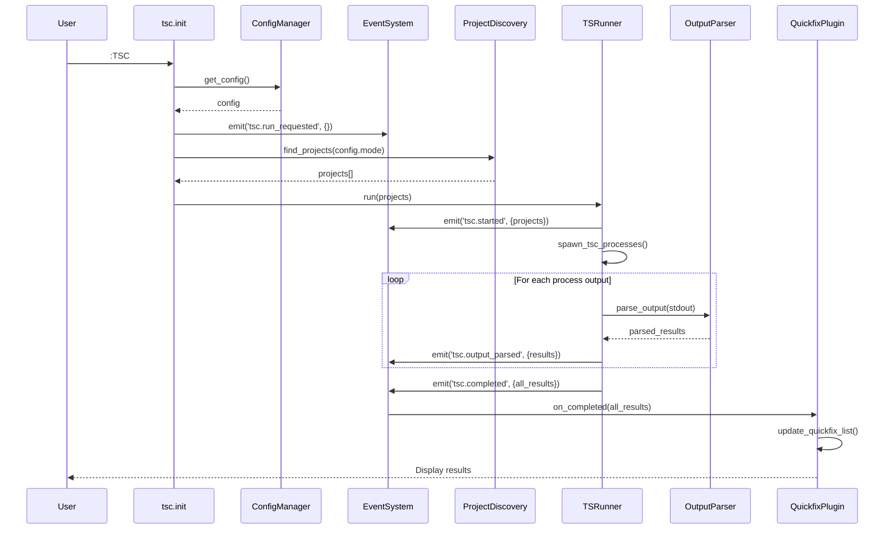
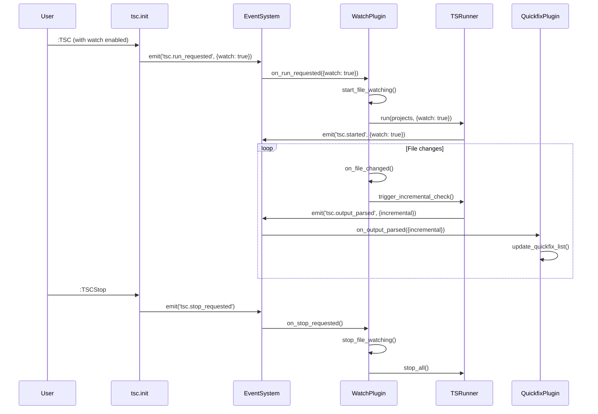
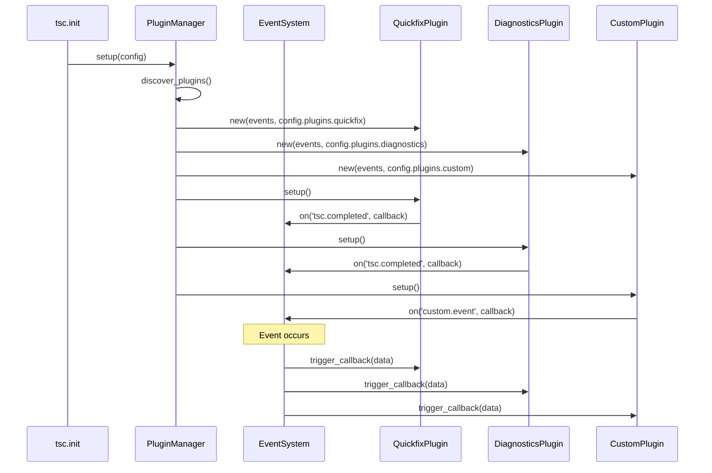

# tsc.nvim 3.0 - Technical Design Document

## Executive Summary

tsc.nvim 3.0 represents a complete rewrite focusing on simplification, extensibility, and core capabilities. The new architecture eliminates tight coupling with external plugins while providing a robust plugin system for extensibility.

## Core Design Principles

1. **Separation of Concerns** - Each module has a single, well-defined responsibility
2. **Event-Driven Architecture** - Components communicate through events, not direct coupling
3. **Plugin-First Design** - Core functionality implemented as plugins
4. **Configuration Simplicity** - Focused, declarative configuration API
5. **Async by Default** - All operations non-blocking

## High-Level Architecture

```
┌─────────────────────────────────────────────────────────────────┐
│                         tsc.nvim 3.0                            │
├─────────────────────────────────────────────────────────────────┤
│                       Plugin Layer                             │
│  ┌─────────────┐  ┌─────────────┐  ┌─────────────┐  ┌─────────┐ │
│  │  Quickfix   │  │   Watch     │  │ Diagnostics │  │ Custom  │ │
│  │   Plugin    │  │   Plugin    │  │   Plugin    │  │ Plugins │ │
│  └─────────────┘  └─────────────┘  └─────────────┘  └─────────┘ │
├─────────────────────────────────────────────────────────────────┤
│                       Event System                             │
│     ┌─────────────────────────────────────────────────────────┐ │
│     │              Event Bus (Pub/Sub)                       │ │
│     │   • tsc.started    • tsc.completed    • tsc.error     │ │
│     │   • project.found  • output.parsed    • watch.change  │ │
│     └─────────────────────────────────────────────────────────┘ │
├─────────────────────────────────────────────────────────────────┤
│                        Core Layer                              │
│  ┌─────────────┐  ┌─────────────┐  ┌─────────────┐  ┌─────────┐ │
│  │   Runner    │  │   Parser    │  │  Discovery  │  │ Config  │ │
│  │  (Process   │  │  (Output    │  │ (Project    │  │Manager  │ │
│  │   Mgmt)     │  │  Parsing)   │  │  Finding)   │  │         │ │
│  └─────────────┘  └─────────────┘  └─────────────┘  └─────────┘ │
├─────────────────────────────────────────────────────────────────┤
│                      Utility Layer                             │
│  ┌─────────────┐  ┌─────────────┐  ┌─────────────┐              │
│  │   Process   │  │   Async     │  │ FileSystem  │              │
│  │   Utils     │  │   Utils     │  │   Utils     │              │
│  └─────────────┘  └─────────────┘  └─────────────┘              │
└─────────────────────────────────────────────────────────────────┘
```

## Core Features & Capabilities

### 1. Non-blocking Execution
- **Asynchronous process management** using vim.fn.jobstart()
- **Event-driven updates** to prevent UI freezing
- **Cancellable operations** with proper cleanup
- **Progress tracking** without blocking user input

### 2. Comprehensive Project Analysis
- **Project discovery** with configurable modes (project/package/monorepo)
- **Multi-project support** for monorepos
- **Incremental checking** in watch mode
- **Configurable scope** based on project structure

### 3. Configurable Architecture
- **Mode-based configuration** (project, package, monorepo)
- **Plugin-specific settings** with validation
- **Runtime configuration** override support
- **Schema validation** for configuration

### 4. Integrated Error Handling
- **Quickfix list integration** as default
- **Multiple output formats** (quickfix, json, raw)
- **Diagnostic integration** for LSP compatibility
- **Error message enhancement** through plugins

## Simplified Configuration API

```lua
-- Simplified Configuration API
require('tsc').setup({
  -- Core execution mode
  mode = 'project',        -- 'project' | 'package' | 'monorepo'
  
  -- Project discovery configuration
  discovery = {
    root_markers = { 'package.json', 'tsconfig.json' },
    tsconfig_name = 'tsconfig.json',
    max_projects = 20,
    exclude_patterns = { 'node_modules', '.git' },
  },
  
  -- TypeScript execution
  typescript = {
    bin = nil,              -- Auto-detect if nil
    flags = '--noEmit',     -- Simple string flags
    timeout = 30000,        -- 30 second timeout
    working_dir = nil,      -- Auto-detect project root
  },
  
  -- Output configuration
  output = {
    format = 'quickfix',    -- 'quickfix' | 'json' | 'raw'
    auto_open = true,       -- Auto-open quickfix on errors
    auto_close = true,      -- Auto-close quickfix when no errors
  },
  
  -- Plugin configuration (extensible)
  plugins = {
    quickfix = { enabled = true },
    watch = { enabled = false },
    diagnostics = { enabled = false },
  }
})
```

## Repository Structure

```
tsc.nvim/
├── lua/
│   └── tsc/
│       ├── init.lua                    # Main entry point & public API
│       ├── core/
│       │   ├── events.lua              # Event system (pub/sub)
│       │   ├── runner.lua              # TypeScript process management
│       │   ├── parser.lua              # Output parsing engine
│       │   ├── discovery.lua           # Project discovery logic
│       │   └── lifecycle.lua           # Plugin lifecycle management
│       ├── config/
│       │   ├── init.lua                # Configuration manager
│       │   ├── schema.lua              # Configuration validation
│       │   ├── defaults.lua            # Default configuration
│       │   └── migration.lua           # 2.x → 3.x migration
│       ├── plugins/
│       │   ├── init.lua                # Plugin registry & loader
│       │   ├── quickfix.lua            # Quickfix list integration
│       │   ├── watch.lua               # File watching functionality
│       │   ├── diagnostics.lua         # LSP diagnostics integration
│       │   └── better_messages.lua     # Error message enhancement
│       ├── utils/
│       │   ├── async.lua               # Async utilities & coroutines
│       │   ├── fs.lua                  # File system operations
│       │   ├── process.lua             # Process management utilities
│       │   ├── path.lua                # Path manipulation
│       │   └── validate.lua            # Validation helpers
│       └── compat/
│           ├── v2.lua                  # v2.x compatibility layer
│           └── commands.lua            # Legacy command aliases
├── tests/
│   ├── unit/
│   │   ├── core/
│   │   │   ├── events_spec.lua
│   │   │   ├── runner_spec.lua
│   │   │   ├── parser_spec.lua
│   │   │   └── discovery_spec.lua
│   │   ├── plugins/
│   │   │   ├── quickfix_spec.lua
│   │   │   ├── watch_spec.lua
│   │   │   └── diagnostics_spec.lua
│   │   └── utils/
│   │       ├── async_spec.lua
│   │       ├── fs_spec.lua
│   │       └── process_spec.lua
│   ├── integration/
│   │   ├── basic_workflow_spec.lua
│   │   ├── monorepo_workflow_spec.lua
│   │   ├── watch_mode_spec.lua
│   │   └── plugin_integration_spec.lua
│   └── fixtures/
│       ├── projects/
│       │   ├── single-project/
│       │   ├── monorepo/
│       │   └── package-in-monorepo/
│       └── outputs/
│           ├── tsc-normal.txt
│           ├── tsc-watch.txt
│           └── tsc-errors.txt
├── docs/
│   ├── README.md
│   ├── configuration.md
│   ├── plugins/
│   │   ├── creating-plugins.md
│   │   ├── quickfix.md
│   │   ├── watch.md
│   │   └── diagnostics.md
│   ├── examples/
│   │   ├── basic-setup.lua
│   │   ├── monorepo-setup.lua
│   │   └── custom-plugin.lua
│   ├── api/
│   │   ├── core.md
│   │   ├── events.md
│   │   └── utils.md
│   └── migration/
│       ├── from-2x.md
│       └── breaking-changes.md
├── examples/
│   ├── configurations/
│   │   ├── basic.lua
│   │   ├── monorepo.lua
│   │   └── advanced.lua
│   └── plugins/
│       ├── custom-notify.lua
│       └── slack-integration.lua
└── TSC_3.0_DESIGN.md                   # This file
```

## Core Module Specifications

### 1. Event System (lua/tsc/core/events.lua)

**Purpose**: Provide pub/sub event system for component communication

**Key Features**:
- Event subscription/unsubscription
- Async event handling
- Error isolation between listeners
- Event namespacing

**Events**:
```lua
-- Core tsc.nvim events
local EVENTS = {
  -- Lifecycle events
  'tsc.initialized',        -- Plugin initialized
  'tsc.run_requested',      -- User requested type-checking
  'tsc.started',            -- Type-checking started
  'tsc.completed',          -- Type-checking completed
  'tsc.stopped',            -- Type-checking stopped
  'tsc.error',              -- Error occurred
  
  -- Process events
  'tsc.process_started',    -- Individual process started
  'tsc.process_completed',  -- Individual process completed
  'tsc.process_error',      -- Process error
  
  -- Output events
  'tsc.output_received',    -- Raw output received
  'tsc.output_parsed',      -- Output parsed
  'tsc.results_ready',      -- Results ready for consumption
  
  -- Project events
  'tsc.project_discovered', -- Project discovered
  'tsc.project_validated',  -- Project validated
  
  -- Watch events
  'tsc.watch_started',      -- Watch mode started
  'tsc.watch_stopped',      -- Watch mode stopped
  'tsc.file_changed',       -- File changed in watch mode
  
  -- Plugin events
  'tsc.plugin_loaded',      -- Plugin loaded
  'tsc.plugin_error',       -- Plugin error
}
```

### 2. Configuration Manager (lua/tsc/config/init.lua)

**Purpose**: Handle configuration validation, defaults, and migration

**Key Features**:
- Schema validation
- Default value management
- Configuration merging
- Migration support
- Runtime configuration override

### 3. TypeScript Runner (lua/tsc/core/runner.lua)

**Purpose**: Manage TypeScript compiler processes

**Key Features**:
- Asynchronous process spawning
- Process lifecycle management
- Output stream handling
- Error handling and cleanup
- Multi-project support

### 4. Project Discovery (lua/tsc/core/discovery.lua)

**Purpose**: Find and validate TypeScript projects

**Key Features**:
- Mode-based discovery (project/package/monorepo)
- Configurable root markers
- Project validation
- Exclusion patterns
- Caching for performance

### 5. Plugin System (lua/tsc/plugins/init.lua)

**Purpose**: Load and manage plugins

**Key Features**:
- Plugin registration and loading
- Dependency resolution
- Lifecycle management
- Error isolation
- Configuration validation

## Sequence Diagrams

### Normal Type-Checking Flow



### Watch Mode Flow



### Plugin System Flow



## Plugin System Architecture

### Plugin Interface

```lua
---@class Plugin
---@field name string Plugin name
---@field version string Plugin version
---@field dependencies string[] Plugin dependencies
local Plugin = {}

---Create new plugin instance
---@param events Events Event system
---@param config table Plugin configuration
---@return Plugin
function Plugin.new(events, config) end

---Initialize plugin
---Should register event listeners and set up resources
function Plugin:setup() end

---Clean up plugin resources
function Plugin:cleanup() end

---Get plugin status
---@return table Status information
function Plugin:status() end
```

### Core Plugins

#### 1. Quickfix Plugin
- **Purpose**: Integrate with Neovim's quickfix list
- **Events**: `tsc.completed`, `tsc.cleared`
- **Configuration**: `auto_open`, `auto_close`, `auto_focus`, `title`

#### 2. Watch Plugin
- **Purpose**: File watching and incremental checking
- **Events**: `tsc.started`, `tsc.stopped`, `file.changed`
- **Configuration**: `enabled`, `auto_start`, `debounce_ms`, `patterns`

#### 3. Diagnostics Plugin
- **Purpose**: LSP diagnostics integration
- **Events**: `tsc.completed`, `tsc.cleared`
- **Configuration**: `enabled`, `namespace`, `severity`

#### 4. Better Messages Plugin
- **Purpose**: Enhance TypeScript error messages
- **Events**: `tsc.output_parsed`
- **Configuration**: `enabled`, `template_dir`

## Migration Strategy

### Backward Compatibility

1. **Automatic Configuration Migration**
   - Detect 2.x configuration format
   - Transform to 3.x format
   - Show migration warnings

2. **Legacy Command Support**
   - Maintain existing commands (`:TSC`, `:TSCStop`, etc.)
   - Provide deprecation warnings
   - Gradual transition path

3. **Plugin Integration**
   - Maintain existing plugin behavior
   - Provide migration guide for plugin authors
   - Compatibility layer for common integrations

### Migration Timeline

1. **Phase 1**: Core infrastructure (Events, Config, Runner)
2. **Phase 2**: Plugin system and core plugins
3. **Phase 3**: Advanced features and optimization
4. **Phase 4**: Testing and documentation
5. **Phase 5**: Migration tools and release

## Testing Strategy

### Unit Testing
- Test each module in isolation
- Mock external dependencies
- Cover edge cases and error conditions

### Integration Testing
- Test complete workflows
- Test plugin interactions
- Test different project structures

### Performance Testing
- Benchmark against 2.x
- Test with large monorepos
- Memory usage profiling

## Key Benefits

### 1. Simplified Configuration
- Reduced from 15+ options to 4 clear sections
- Mode-based configuration eliminates complexity
- Plugin-specific settings are isolated

### 2. Enhanced Extensibility
- Plugin system allows custom integrations
- Event-driven architecture enables loose coupling
- Clear plugin API with comprehensive documentation

### 3. Improved Performance
- Async-first design prevents blocking
- Efficient process management
- Optimized project discovery

### 4. Better Architecture
- Clear separation of concerns
- Testable components
- Maintainable codebase

### 5. Smooth Migration
- Automatic configuration migration
- Backward compatibility layer
- Comprehensive migration guide

## Implementation Priority

### High Priority (Core Functionality)
1. Event system
2. Configuration manager
3. Basic runner
4. Project discovery
5. Quickfix plugin

### Medium Priority (Enhanced Features)
1. Plugin system framework
2. Watch plugin
3. Diagnostics plugin
4. Better messages plugin
5. Migration tools

### Low Priority (Polish & Optimization)
1. Performance optimization
2. Advanced configuration
3. Custom plugin examples
4. Extended documentation
5. Release preparation

## Success Metrics

1. **Functionality**: All 2.x features working in 3.x
2. **Performance**: Equal or better performance than 2.x
3. **Usability**: Simpler configuration with same capabilities
4. **Extensibility**: Plugin system supports custom integrations
5. **Migration**: Smooth transition from 2.x to 3.x

This design document serves as the blueprint for tsc.nvim 3.0, ensuring a robust, maintainable, and extensible architecture that meets all requirements while providing a clear path forward.